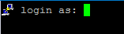

## PuTTY sometimes displays icons in the terminal

You sometimes see PuTTY icons on the side of the terminal (example below).

This is a new security feature in PuTTY 0.71. It is meant to signify that PuTTY itself is outputting those lines and not some remote server. Full details are available [here](https://www.chiark.greenend.org.uk/~sgtatham/putty/wishlist/vuln-auth-prompt-spoofing.html).

## How can I edit or create connections in bulk?

Currently, mRemoteNG does not have a feature to support editing or creating connections in bulk. See [Creating Bulk Connections](howtos/bulk-connections.md) for more info on this.
