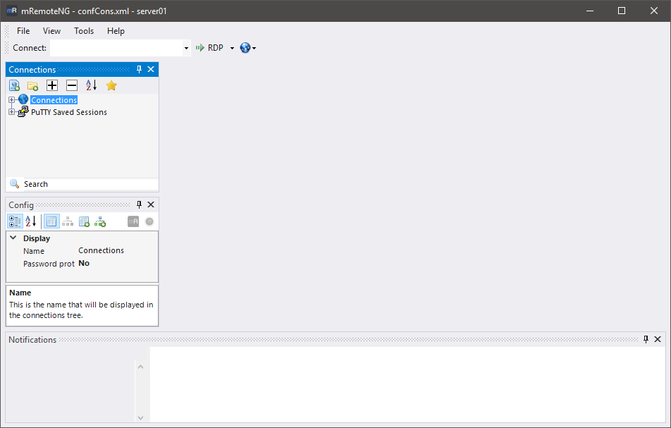

**mRemoteNG** is a fork of mRemote: an open source, tabbed, multi-protocol,
remote connections manager for Windows. It lets you view and manage all of your
remote connections in one place, in tabs, instead of one window per tool.

## Supported protocols

RDP, VNC, SSH, Telnet, HTTP/HTTPS, rlogin, Raw Socket, PowerShell Remoting,
AnyDesk, VMRC (VMware), MSRA (Remote Assistance), OpenSSH (native Windows),
Winbox (MikroTik), WSL, Terminal, and Serial (COM port).

## Where to start

- [User Interface](./user-interface/index.md) — a tour of the main window,
  panels, menus and the connections dialog.
- [Folders and Inheritance](./folders-and-inheritance.md) — set a property once
  on a folder and let every connection below it inherit the value.
- [Protocols](./protocols/index.md) — protocol-specific notes and options.
- [Keyboard Shortcuts](./keyboard-shortcuts.md) — the full keybinding reference.
- [HowTos](./howtos/sshtunnel.md) — worked examples: SSH tunnels, external
  tools, bulk imports, credential vaults.

Upgrading from mRemote or an older mRemoteNG? See [Migrate](./migrate.md).
Hitting a problem? Start with [Troubleshooting](./troubleshooting.md), then
[Known Issues](./known-issues.md) and the [FAQ](./faq.md).

## Download

Builds for x64, x86 and ARM64 are published on the
[releases page](https://github.com/robertpopa22/mRemoteNG/releases/latest).
