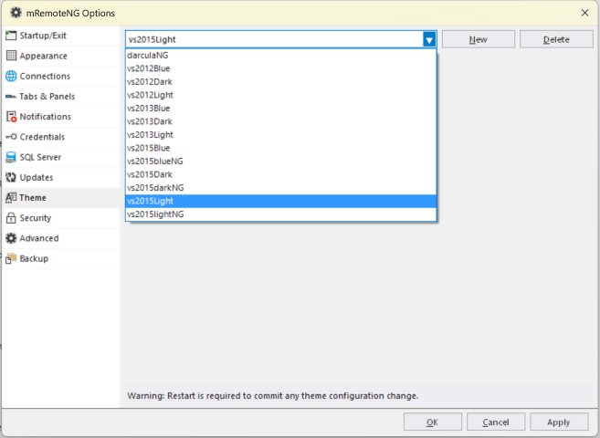

These can be chosen from the **File → Options**. There are also possibilities to create your own themes inside the settings for themes. By default mRemoteNG has turned off the themes but they are easily enabled by choosing another theme rather then the default (vs2015light) one.

:::warning

In order for the theme to load, mRemoteNG needs to be restarted

:::
