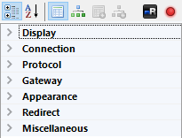
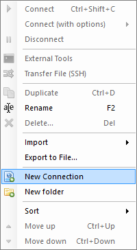
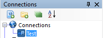
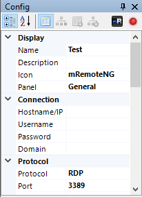
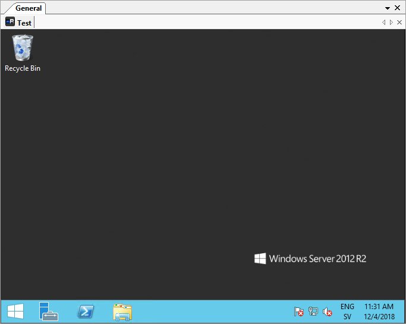

The connections dialog is the main collection of all connections that inside mRemoteNG. This document will explain the details of the connections dialog.

## Connection Tree

### Menu Items

- **Red** - New Connection
- **Green** - New Folder
- **Blue** - View (Expand/Collapse all folders)
- **Yellow** - Ascending sort

### New Connection

:::tip

You can also duplicate an existing connection. Just right click on folder or connection to duplicate the item. The information is then carried over for editing. This can save a lot of time when the connection list is large.

:::

:::tip

When inside an SSH session you can open the PuTTY menu by holding down the CTRL key while right-clicking into the session window.

:::

Creates a new connection item in the connections dialog after where cursor is present.

### New Folder

:::tip

Folders can help to make adding connections easier. By setting a folder with some values that can be inheritaded down to the connections.

:::

Creates a new folder in connections dialog after where cursor is present.

### View

Collapses or expands all directories in the connection dialog. Useful when working with a lot of connections sorted in different directories.

### Ascending

Works like a sort or a refresh to get connection in ascending order. (Descending order is note supported yet) When you have been moving around in the tree of connections, just click this item to refresh the list and get everything in ascending ordering.

## Configuration

Config dialog to setup the connection specific properties. This includes inheritance from other items before the item and more. Details below is about how to work with this dialog to get the most out of connections and configuration.

### Menu Items {#menu-items-1}

- **Red** - Sort values Categories or Alphabetical
- **Green** - Show Properties, Inheritance values
- **Blue** - Connection icon
- **Yellow** - Host status (based on ICMP ping)

### Sort Values

Sorts the values in properties either by Categories or Alphabetically.

- Categories sort - Shows values in categories with expanding options.
- Alphabetical sort - Expands everything and shows values in alphabetical order instead

### Icon

:::note

Don't forget that mRemoteNG will save the change on exit auto unless you have unchecked this setting in options.

:::

The icon indicates the visual identifier for the connection. Clicking the icon will let you set a different icon for the connection.

### Tab Color

:::note

The Tab Color property is available in the Display category of the connection properties.

:::

You can set a custom color for connection tabs to help distinguish between different environments (e.g., Development, Testing, Production). This can be especially useful when working with critical systems like Live servers, where you want a clear visual reminder.

To set a tab color:

1.  Select your connection in the Connections panel
2.  In the Config panel, expand the **Display** category
3.  Find the **Tab Color** property
4.  Enter a color name (e.g., "Red", "Green", "Blue") or a hex color code (e.g., "#FF0000", "#00FF00")
5.  Leave empty to use the default theme color

The tab color will be applied when you open the connection. You can use inheritance to set the same color for multiple connections in a folder.

### Status

:::note

In order for this to work you have to open up ICMP. On windows servers this is also disabled in windows firewall.

:::

Is a indicator that will glow red or green depending on the status of the host. The status is based on ICMP ping to the host.

## Creating a connection

:::tip

You can see an indicator in the properties window that is glowing green:

This icon does a ICMP ping on to check response from the server. If it glows green it indicates a connection response can be made using ping to the host. However this is turned off on windows by default. You have to enable ICMP and allow the firewall access for it.

:::

Right click on the root item (the little blue globe named **Connections**) in the Connections panel and select **New Connection**.

A new item shows up under the root item. You can give it a name now (or rename it later). We'll just call this connection "Test" for the moment.

Now lets look at the config panel in the bottom left, just under the connections panel. As you may notice this is where you configure all the properties of connections and folders.

Fill in the necessary properties and you have just created your first connection! You can now connect to the server with a simple double-click on the "Test"-connection!

## Opening and Closing Connections

:::note

If the connecting fails, the notifications panel will pop up and show an error message describing the problem.

:::

There are multiple ways to open a connection in mRemoteNG, but the easiest way is to double click the connection in the Connections panel. If you double click the connection you will notice that the connection is going to try and open in a new panel called "General" and under a tab called "Test". If all goes well you should see the remote desktop without any problems.

### Opening several connections at once

:::info Version

Added in v1.82.1

:::

Select more than one connection in the Connections panel and press **Enter** to open them all in one go. Hold **Shift** and use the arrow keys to pick a run of neighbouring connections, or hold **Ctrl** and click to pick them one at a time.

Folders and the **Connections** root are skipped when a multiple selection sweeps them up, so a Shift-selection that runs across a folder opens only the connections it caught, not everything filed under that folder. A folder with its own **Hostname** is the exception: that is a connection in its own right, so it opens like any other. Selecting a single folder and pressing **Enter** is unchanged — it still opens the folder itself.

:::warning

Every selected connection opens at once, each in its own tab. Selecting a large run and pressing **Enter** will start all of them together, which can be slow on a busy machine.

:::

To close the connection you can do any of the following:

- Log off in the start menu (Closes the connection and logs you out completely from RDP)
- Close the panel with the (Which leaves your session active on server but closes connection in mRemoteNG)
- Close the connection tab with (Also keeps your login active on server but closes RDP connection in mRemoteNG)
- Double click the connection tab (Same as above where the connection is active on server but closes RDP connection in mRemoteNG)
